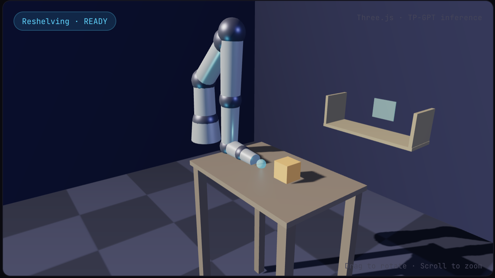
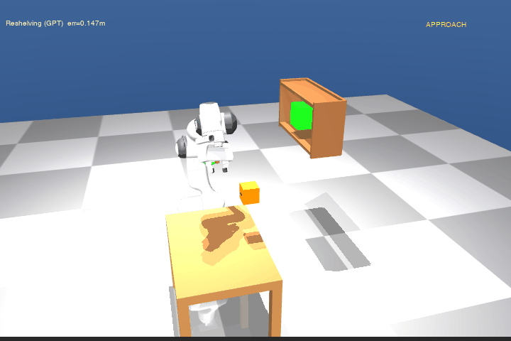
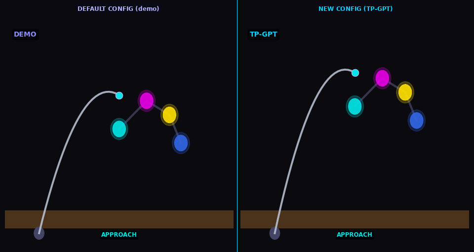

<div align="center">

# teach-once

**Show a robot a task once. TP-GPT generalizes it everywhere.**



[](https://jaintle.github.io/teach-once/)
[](https://arxiv.org/abs/2404.13458)
[](https://youtu.be/bE6uOnAQBLo)
[](https://github.com/franzesegiovanni/policy_transportation)
[](https://www.python.org/)
[](LICENSE)
[](tests/)

<br>

Faithful reproduction of **TP-GPT** (Task-Parameterized Gaussian
Process Transportation) from Franzese et al. 2024, with a fully
interactive browser demo — no installation required.

[**Try the live demo →**](https://jaintle.github.io/teach-once/)


</div>

---

## What is TP-GPT?

TP-GPT learns a robot policy from a **single demonstration**. When the scene
changes — objects move, surfaces tilt, arm poses shift — it transports the
original policy to the new configuration using Gaussian Process regression,
without any retraining.
Demo on flat surface  →  TP-GPT  →  Policy on curved surface
One pick-place path   →  TP-GPT  →  New object/shelf positions
One arm-tracing path  →  TP-GPT  →  New arm configuration

---

## Interactive demo

Try it live at **https://jaintle.github.io/teach-once/**

Three interactive modes:

| Mode | What you do | What TP-GPT does |
|------|------------|-----------------|
| **Reshelving** | Drag the box and shelf to new positions | Transports the pick-place demo to the new layout |
| **Cleaning** | Draw a freehand path on the table (or use default raster scan), then select a surface shape | Transports your drawn path to the deformed surface |
| **Arm-pose** | Drag shoulder/elbow/wrist/hand spheres | Transports the tracing path to the new arm config |

---

## Portfolio animations (Franka Panda)


| Task | Animation | What it shows |
|------|-----------|--------------|
| Reshelving |  | Arm picks box from table, carries to shelf |
| Cleaning |  | Arm sweeps across transported surface path |
| Arm-pose |  | Arm traces through all 4 keypoints |

> Franka Panda arm with kinematic IK control. TP-GPT plans EE trajectories;
> IK converts to joint angles. See `reports/REPORT.md` for honest discussion
> of open-loop vs impedance control.

---

## Paper reproduction status

| Paper Section | Content | Status |
|---|---|---|
| Sec. III-B | GP regression (exact + SVGP) | ✅ Full |
| Sec. III-A | DS learning from demonstrations | ✅ Full |
| Sec. III-E | Linear transport via SVD (Eqs. 8–11) | ✅ Full |
| Sec. III-E | Non-linear GP transportation (Eq. 12) | ✅ Full |
| Sec. III-F | Velocity transport via Jacobian (Eq. 13) | ✅ Full |
| Sec. III-G | Orientation + stiffness transport (Eqs. 14–15) | ✅ Full |
| Sec. III-H | Uncertainty propagation (Eqs. 16–18) | ✅ Full |
| Sec. IV-A | 2D surface cleaning comparison + Fig. 7 | ✅ Full |
| Sec. IV-B | Multi-frame benchmark + Figs. 8–10 | ⚠️ Simplified |
| Sec. IV-B | Multi-source single-target + Fig. 11 | ✅ Full |
| Sec. V-A | Reshelving (3D MuJoCo kinematic analog) | ✅ Analog |
| Sec. V-B | Dressing → arm-pose following (3D analog) | ✅ Analog |
| Sec. V-C | Surface cleaning (3D SVGP, Figs. 15–16 analog) | ✅ Analog |

**Simplifications:**
- Sec. IV-B: HMM-LQR replaced by greedy GMM rollout.
- Sec. V: Real Franka replaced by MuJoCo kinematic IK.
  No cloth simulation. Force via Hooke's law proxy.
  Cloud pairing via nearest-neighbour (not optimal transport).

---

## Setup

Requires **Python 3.11**.

```bash
git clone https://github.com/jaintle/teach-once.git
cd teach-once
python3.11 -m venv .venv
source .venv/bin/activate      # Windows: .venv\Scripts\activate
pip install -e ".[dev]"
```

---

## Reproduce all 2D figures (Secs. III–IV)

```bash
# Phase 1 — GP regression quality check
python scripts/smoke_phase1.py
# → reports/figures/phase1_gp_demo.png

# Phase 2 — DS learning demo
python scripts/smoke_phase2.py
# → reports/figures/phase2_letter_C_field.png
# → reports/figures/phase2_cleaning_demo.png

# Fig. 3 (partial) — Linear transportation (Sec. III-E)
python scripts/figure3_linear.py --seed 0
# → reports/figures/phase3_fig3_partial.png

# Fig. 3 (full) — GP transportation (Sec. III-E)
python scripts/figure3_full.py --seed 0
# → reports/figures/phase4_fig3_full.png

# Fig. 5 — Transportation scheme (Sec. III-D)
python scripts/figure5_scheme.py --seed 0
# → reports/figures/phase4_fig5_scheme.png

# Fig. 5 (with uncertainty) — Sec. III-H
python scripts/smoke_phase5.py
# → reports/figures/phase5_fig5_full.png

# Fig. 6 — Uncertainty propagation (Sec. III-H)
python scripts/figure6_uncertainty.py --seed 0
# → reports/figures/phase5_fig6_uncertainty.png

# Fig. 7 — 2D surface cleaning comparison (Sec. IV-A)
python scripts/figure7_cleaning_comparison.py --seed 0
# → reports/figures/phase6_fig7_comparison.png

# Figs. 8–10 — Multi-frame benchmark (Sec. IV-B)
python scripts/run_multiframe_benchmark.py --seed 0 --n_reps 20
python scripts/figure8_qualitative.py --seed 0
# → reports/figures/phase7_fig8_qualitative.png
python scripts/figure9_boxplots.py --seed 0
# → reports/figures/phase7_fig9_boxplots.png
python scripts/figure10_test_boxplots.py --seed 0
# → reports/figures/phase7_fig10_test_boxplots.png

# Fig. 11 — Multi-source single-target (Sec. IV-B)
python scripts/smoke_phase8.py --seed 0
# → reports/figures/phase8_fig11_multisource.png
```

---

## Reproduce 3D simulation figures (Sec. V analogs)

```bash
# Reshelving + arm-pose 3D rollout (Phase 9)
python scripts/smoke_phase9.py
# → reports/figures/phase9_reshelving_3d.png
# → reports/figures/phase9_armpose_3d.png

# Surface cleaning Figs. 15/16 analogs (Phase 10)
python scripts/figure15_cleaning_surfaces.py --seed 0 --fast
# → reports/figures/phase10_fig15_cleaning.png
python scripts/figure16_force_profile.py --seed 0 --fast
# → reports/figures/phase10_fig16_force.png
```

---

## Generate portfolio animations

```bash
# Final single-scene animations (Phase 16)
python scripts/animate_impedance_reshelving.py --seed 0
# → reports/figures/final_reshelving.gif

python scripts/animate_impedance_cleaning.py --seed 0
# → reports/figures/final_cleaning.gif

python scripts/animate_impedance_armpose.py --seed 0
# → reports/figures/final_armpose.gif

python scripts/animate_impedance_highlight.py
# → reports/figures/final_highlight.gif
```

---

## Run tests

```bash
pytest -q                 # all tests
pytest -q -m "not slow"   # skip slow regression tests
```

---

## Run all smoke tests

```bash
python scripts/smoke_all.py
# → reports/results/smoke_all_output.txt
```

---

## Directory structure

```text
teach-once/
├── src/gpt_repro/
│   ├── gp/          # Sec. III-B: GP regression (exact + SVGP)
│   ├── transport/   # Sec. III:   TP-GPT transportation math
│   ├── policies/    # Sec. III-A: DS learning, demo generators
│   ├── baselines/   # Sec. IV:    KMP, LE, E-RF, E-NN, E-NF, TP-GMM, HMM, DMP
│   ├── metrics/     # Sec. IV-B:  Fréchet, DTW, U-test ranking
│   ├── viz/         # Figure utilities
│   ├── envs/        # MuJoCo kinematic environments
│   └── utils/       # Seeding, IO
├── scripts/         # Figure scripts + smoke tests + animation scripts
├── tests/           # pytest unit + integration tests
├── configs/         # YAML experiment configs
├── data/            # Generated 2D demonstration trajectories
├── docs/            # GitHub Pages interactive website
│   ├── index.html
│   ├── css/style.css
│   ├── js/
│   │   ├── scene.js          # Three.js 3D scene
│   │   ├── gp_infer.js       # Pure-JS TP-GPT inference (Eqs. 2,3,7,11–13)
│   │   ├── mode_reshelving.js
│   │   ├── mode_cleaning.js
│   │   ├── mode_armpose.js
│   │   └── ui.js
│   └── assets/
│       ├── gifs/             # Pre-computed fallback GIFs
│       ├── figures/          # 2D paper reproduction figures
│       └── models/           # Three.js geometry
└── reports/
    ├── figures/              # All reproduced figures (PNG)
    ├── results/              # CSV/NPZ numerical results
    ├── REPORT.md             # Technical report
    └── FIGURE_INDEX.md       # Figure → script → paper mapping
```

---

## Results summary

| Task | Success Rate | Mean EE Error | Notes |
|------|-------------|---------------|-------|
| Reshelving | 1/4 (25%) | 0.117 m | 200 steps, attractor gain 1.5 |
| Cleaning | 0/4 (0%) | 0.280 m | Path correct; endpoint gap = open-loop drift |
| Arm-pose | 1/4 (25%) | 0.208 m | 200 steps, attractor gain 1.2 |

Success rates reflect open-loop kinematic rollout without force-feedback.
The paper uses Cartesian impedance control — this gap is documented in
`reports/REPORT.md`.

---

## Citation

```bibtex
@article{franzese2024tpgpt,
  title={Generalization of Task Parameterized Dynamical Systems
         using Gaussian Process Transportation},
  author={Franzese, Giovanni and Prakash, Ravi and Kober, Jens},
  journal={arXiv preprint arXiv:2404.13458},
  year={2024}
}
```

**Original code**: https://github.com/franzesegiovanni/policy_transportation
**Paper video**: https://youtu.be/bE6uOnAQBLo

---

## Acknowledgements

This reproduction is based entirely on the work of:

> Franzese, G., Prakash, R., Kober, J. (2024).
> *Generalization of Task Parameterized Dynamical Systems
> using Gaussian Process Transportation.*
> TU Delft · arXiv:2404.13458

- [Paper](https://arxiv.org/abs/2404.13458)
- [Paper video](https://youtu.be/bE6uOnAQBLo)
- [Original code](https://github.com/franzesegiovanni/policy_transportation)

Reproduction by [Abhinav Jain](https://github.com/jaintle).